# 🎨 Artist NFT 艺术品交易平台

[](https://reactjs.org/)
[](https://www.typescriptlang.org/)
[](https://hardhat.org/)
[](https://soliditylang.org/)
[](https://vitejs.dev/)
[](https://docs.ethers.io/)
[](LICENSE)

<details open>
<summary><strong>目录（点击展开/折叠）</strong></summary>

- [项目概述](#项目概述)
    - [核心价值](#核心价值)
    - [核心功能](#核心功能)
- [技术栈](#技术栈)
    - [前端技术栈](#前端技术栈)
    - [区块链技术栈](#区块链技术栈)
    - [存储架构](#存储架构)
- [智能合约](#智能合约)
    - [智能合约架构](#智能合约架构)
    - [版税机制实现](#版税机制实现)
    - [安全设计模式](#安全设计模式)
    - [状态管理优化](#状态管理优化)
- [扩展规划：ArtistCoin 分红代币](#扩展规划artistcoin-分红代币)
    - [代币经济模型](#代币经济模型)
    - [技术架构](#技术架构-1)
    - [核心特性](#核心特性)
    - [开发路线图](#开发路线图)
- [项目架构](#项目架构)
    - [整体架构](#整体架构)
    - [目录结构](#目录结构)
    - [组件架构](#组件架构)
- [核心功能演示](#核心功能演示)
    - [对于艺术家](#对于艺术家)
    - [对于收藏家](#对于收藏家)
    - [版税管理功能](#版税管理功能)
- [快速开始](#快速开始)
    - [环境要求](#环境要求)
    - [本地开发](#本地开发)
    - [开发环境配置](#开发环境配置)
    - [项目启动](#项目启动)
    - [访问应用](#访问应用)
    - [首次使用指南](#首次使用指南)
- [开发指南](#开发指南)
    - [项目监控](#项目监控)
    - [测试覆盖](#测试覆盖)
    - [代码质量](#代码质量)
    - [构建发布](#构建发布)
- [配置说明](#配置说明)
    - [网络配置](#网络配置)
    - [存储配置](#存储配置)
    - [钱包集成](#钱包集成)
- [贡献指南](#贡献指南)
- [安全说明](#安全说明)
    - [安全特性](#安全特性)
    - [安全最佳实践](#安全最佳实践)
- [常见问题](#常见问题)
    - [开发环境问题](#开发环境问题)
    - [依赖和构建问题](#依赖和构建问题)
    - [API和网络问题](#api和网络问题)
    - [前端开发问题](#前端开发问题)
    - [调试技巧](#调试技巧)
- [许可证](#许可证)
- [致谢](#致谢)
- [社区支持](#社区支持)
- [联系我们](#联系我们)

</details>

---
## 🌟 项目概述

Artist NFT 是一个基于以太坊的去中心化数字艺术品交易平台，为艺术家提供完整的NFT创作、发行和交易解决方案。平台采用现代化的全栈技术架构，集成了IPFS和Arweave双重存储方案，确保数字艺术品的永久保存和快速访问。

### 🎯 核心价值

- **🎨 艺术家友好** - 简化NFT创作流程，支持富文本编辑和图片上传
- **🏪 交易透明** - 去中心化交易，智能合约自动执行，无中间商
- **💰 版税保护** - 内置ERC-2981版税标准，保障艺术家长期收益
- **🌊 生态集成** - 无缝对接OpenSea等主流NFT市场
- **🔐 数据永存** - IPFS+Arweave双重存储，确保艺术作品永久可访问
- **⚡ 开发体验** - 基于Vite的现代化开发环境，TypeScript类型安全

### ✨ 核心功能

| 功能模块 | 特性描述 | 技术实现 |
|---------|---------|---------|
| **🎨 创作铸造** | 富文本编辑器 + 图片上传 + 一键铸造 | Jodit Editor + File Upload + ERC721 |
| **🏪 交易市场** | NFT浏览 + 分类筛选 + 搜索功能 | React Grid + Filter System |
| **🌊 OpenSea集成** | 实时市场数据 + 收藏集统计 + 事件追踪 | OpenSea API v2 + WebSocket |
| **💰 版税管理** | ERC-2981标准 + 费用设置 + 资金提取 | Smart Contract + Royalty System |
| **🔐 去中心化存储** | IPFS快速访问 + Arweave永久保存 | Dual Storage + Auto Switch |
| **💳 Web3集成** | MetaMask连接 + 多网络支持 + 状态管理 | Ethers.js v6 + Wallet Connect |

### 🛠️ 技术栈

#### 前端技术栈
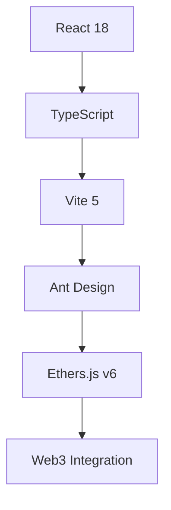

#### 区块链技术栈
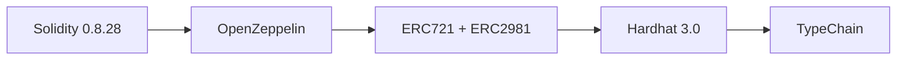

#### 存储架构
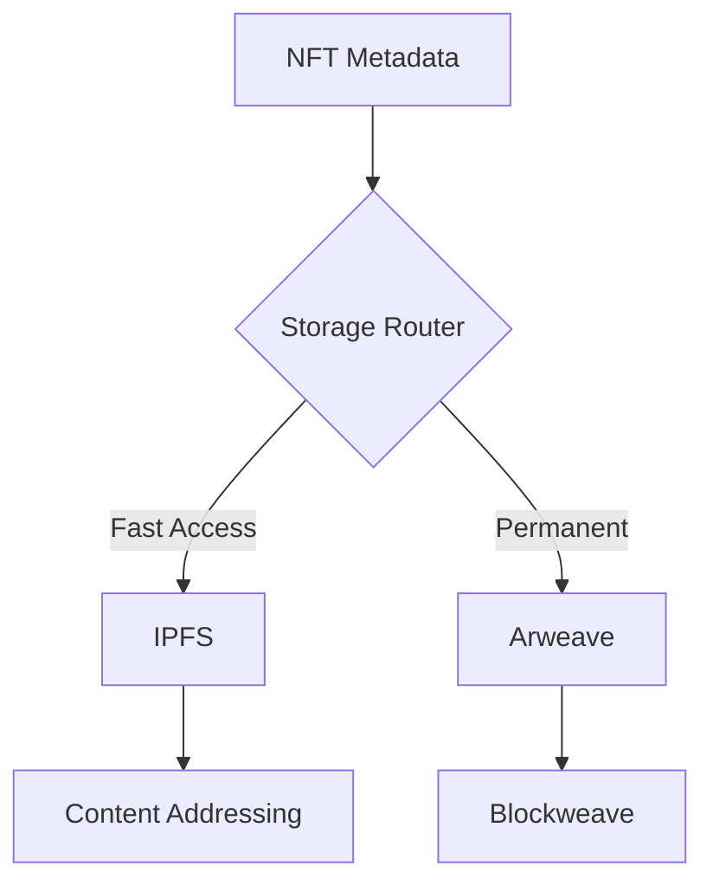

### 🔗 智能合约

#### 🏗️ **智能合约架构**

ArtistNFT合约采用OpenZeppelin模块化设计模式，通过多重继承实现功能的高度解耦和复用：

```solidity
contract ArtistNFT is ERC721URIStorage, ERC721Enumerable, ERC721Royalty, Ownable {
    // Contract implementation
}
```

**继承层级分析**：
- **ERC721URIStorage**: 提供NFT元数据存储功能，支持tokenURI管理
- **ERC721Enumerable**: 支持NFT枚举查询，提供totalSupply、tokenByIndex等方法
- **ERC721Royalty**: 集成ERC-2981版税标准，支持二级市场版税分成
- **Ownable**: 实现权限控制机制，确保关键操作的安全性

### 💰 **版税机制实现**

#### ERC-2981标准兼容
- **标准兼容**: 完全兼容以太坊版税标准，支持所有主流NFT市场
- **动态配置**: 默认2%版税（basis points为200），合约所有者可调整
- **艺术家受益**: 每个NFT独立设置版税接收者，确保艺术家在二级市场持续获益
- **市场集成**: 与OpenSea、LooksRare等主流NFT交易平台无缝集成

#### 费用管理系统
- **铸造收费**: 用户铸造NFT需支付指定费用（默认1 gwei），防止恶意铸造
- **费用收集**: 独立设置费用收集地址，支持DAO治理或团队资金管理
- **资金提取**: 仅费用收集者可提取合约余额，确保资金安全
- **动态费率**: 合约所有者可根据市场情况调整铸造费用

### 🔒 **安全设计模式**

#### 权限控制
```solidity
// 使用OpenZeppelin经过审计的Ownable模式
require(msg.sender == owner(), "Not authorized");
```

#### 重入保护
```solidity
// 通过低级call函数返回值检查，防止重入攻击
(bool success, ) = recipient.call{value: amount}("");
require(success, "Transfer failed");
```

#### 输入验证
```solidity
// 铸造时严格验证支付金额，避免逻辑漏洞
require(msg.value == mintFee, "Incorrect payment amount");
```

#### 接口兼容
```solidity
// 实现supportsInterface，确保合约互操作性
function supportsInterface(bytes4 interfaceId) public view override returns (bool) {
    return super.supportsInterface(interfaceId);
}
```

### ⚡ **状态管理优化**

#### 自增ID机制
- **原子递增**: 使用`_tokenIdCounter.increment()`实现自动递增的token ID
- **数据一致性**: 铸造过程中同时设置元数据和版税信息
- **Gas优化**: 合理的状态变量布局，减少存储操作成本
- **事件驱动**: 关键操作触发事件，便于链下应用监听和索引

#### 事件系统
```solidity
// 关键操作事件定义
event NFTMinted(uint256 indexed tokenId, address indexed owner, string tokenURI);
event RoyaltyUpdated(uint256 tokenId, address recipient, uint96 royaltyFraction);
event FeeCollected(address indexed collector, uint256 amount);
```

### 🧠 扩展规划：ArtistCoin 分红代币

#### 📊 代币经济模型

ArtistCoin 是一个创新的分红型ERC20代币，为平台生态提供激励机制：

| 经济要素 | 详细说明 | 技术实现 |
|---------|---------|---------|
| **最大供应量** | 100 ether | `maxSupply = 100 ether` |
| **分红来源** | 平台交易手续费 | 自动分配机制 |
| **放大因子** | 2^128 | 精确计算小额分红 |
| **锁定机制** | 防止恶意提取 | `locked` 状态控制 |
| **治理功能** | DAO投票权 | 按持有量加权投票 |

#### 🏗️ 技术架构

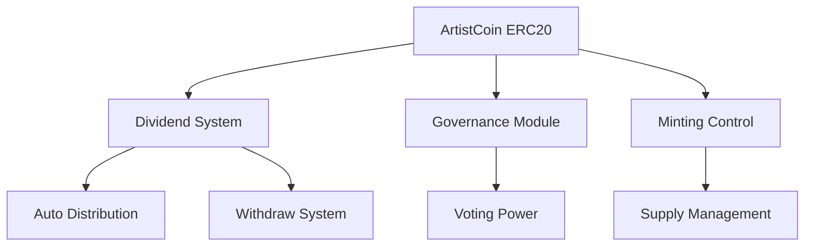

#### ✨ 核心特性

1. **🔄 自动分红**: 通过 `receive()` 函数自动触发分红分配
2. **💎 精确计算**: 使用放大因子确保微小金额的精确分配
3. **🛡️ 安全防护**: ReentrancyGuard + 权限控制 + 输入验证
4. **🗳️ 治理集成**: 持有者可参与平台治理决策
5. **🔒 资金安全**: 多重安全机制防止资金风险

#### 🚀 开发路线图

##### Phase 1: 基础功能 (已完成)
- ✅ ERC20基本功能实现
- ✅ 分红分配机制
- ✅ 安全防护措施
- ✅ 智能合约测试

##### Phase 2: 前端集成 (进行中)
- [ ] ArtistCoin钱包界面
- [ ] 代币铸造和转账功能
- [ ] 分红提取界面
- [ ] 余额和交易历史

##### Phase 3: 治理系统
- [ ] 提案创建和管理
- [ ] 投票系统实现
- [ ] 治理数据分析
- [ ] 社区治理工具

##### Phase 4: 生态集成
- [ ] 去中心化交易所上市
- [ ] 跨链桥接支持
- [ ] DeFi协议集成
- [ ] 生态激励计划

## 📁 项目架构

### 🏗️ 整体架构

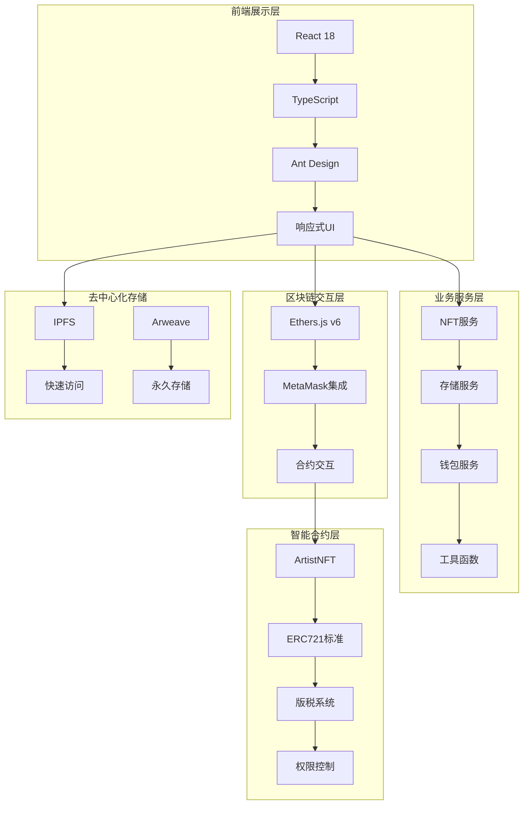

### 📂 目录结构

```
artist-nft/
├── 📁 contracts/          # 智能合约源码
│   ├── 📄 ArtistNFT.sol   # 主要NFT合约
│   └── 📄 Lock.sol        # 示例锁合约
├── 📁 src/                # 前端应用源码
│   ├── 📁 components/     # React组件
│   ├── 📁 service/        # 业务逻辑服务
│   ├── 📁 artifacts/      # 编译后的合约ABI
│   └── 📁 typechain-types/# TypeScript类型定义
├── 📁 test/               # 测试文件
│   ├── 📄 ArtistNFT.ts    # NFT合约测试
│   └── 📄 Lock.ts         # 锁合约测试
├── 📁 scripts/            # 部署脚本
├── 📁 docs/               # 项目文档
└── 📄 配置文件...         # 各种配置文件
```

### 🧩 组件架构

| 层级 | 组件 | 功能描述 | 技术实现 |
|-----|------|---------|---------|
| **展示层** | ArticleEditor | 富文本编辑器 | Jodit + NFT铸造 |
|  | NftCard | NFT展示卡片 | React + CSS Grid |
|  | MarketBrowser | 市场浏览器 | OpenSea API集成 |
| **业务层** | NFTService | NFT操作服务 | Ethers.js交互 |
|  | StorageService | 存储服务 | IPFS/Arweave双存储 |
|  | WalletService | 钱包服务 | MetaMask集成 |
| **数据层** | ContractAPI | 合约接口 | TypeChain类型安全 |
|  | StorageAPI | 存储接口 | RESTful API |
|  | EventListener | 事件监听 | WebSocket实时更新 |

## 🎯 核心功能演示

### 🖼️ 对于艺术家
1. **连接钱包** - 使用MetaMask连接您的数字钱包
2. **上传作品** - 选择您的数字艺术品文件
3. **设置元数据** - 添加作品标题、描述等信息
4. **铸造NFT** - 一键将作品铸造为NFT
   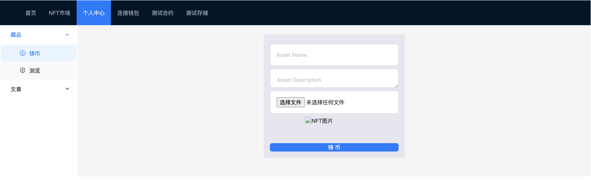
5. **管理作品** - 在个人中心查看和管理您的作品集
   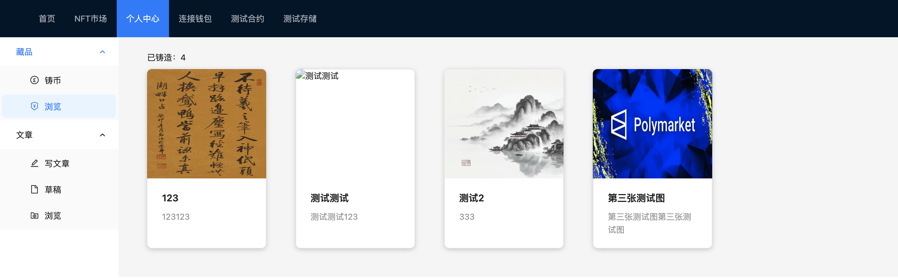

### 🛒 对于收藏家
1. **浏览收藏** - 在藏品列表和文章列表查看所有NFT
   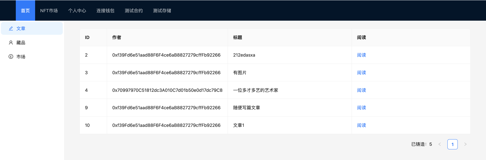
   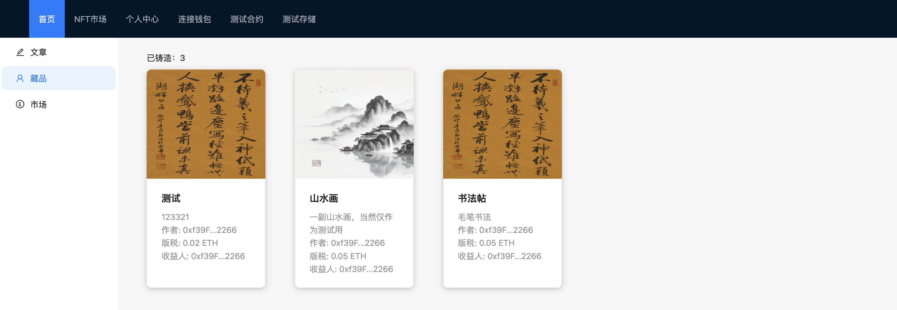
2. **浏览市场** - 在NFT市场发现独特的数字艺术品
   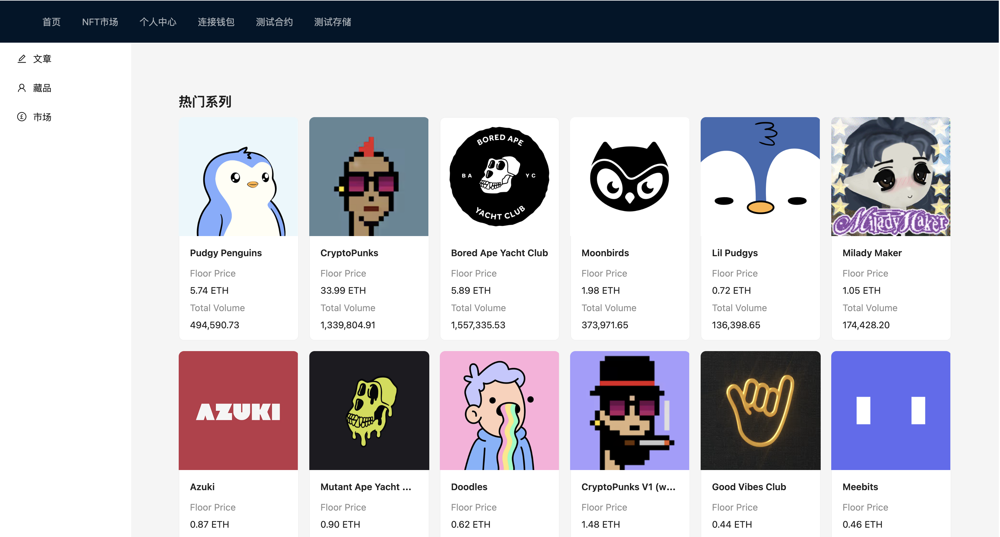
   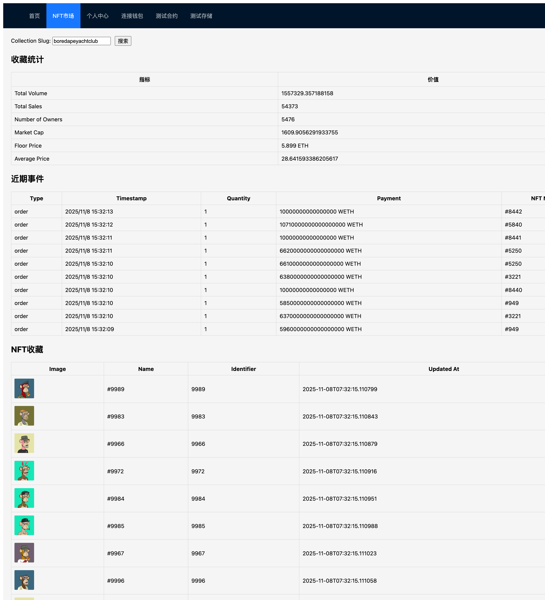
3. **查看详情** - 了解作品信息和创作者背景
4. **购买NFT** - 使用加密货币购买心仪的NFT

### 💰 版税管理功能
1. **版税设置** - 合约所有者可设置版税比例（如2%），确保艺术家在二级市场持续获益
2. **费用管理** - 设置铸造费用和费用收集者地址，管理合约资金
3. **资金提取** - 合约所有者可提取合约中的资金
4. **实时查看** - 显示合约余额和可提取金额
   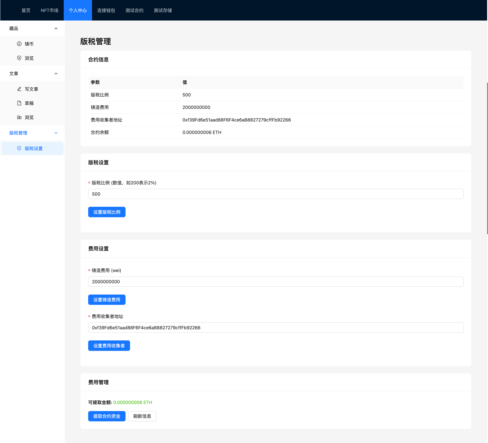

## 🚀 快速开始

### 📋 环境要求

| 组件 | 版本 | 说明 |
|------|------|------|
| **Node.js** | ≥ 18.0.0 | JavaScript运行环境 |
| **npm** | ≥ 9.0.0 | 包管理工具 |
| **Git** | 最新版本 | 版本控制 |
| **MetaMask** | 最新版本 | Web3钱包插件 |
| **IPFS** | 可选 | 去中心化文件存储 |
| **Arweave** | 可选 | 永久数据存储 |

### 🛠️ 本地开发

```bash
# 1. 克隆项目
git clone https://github.com/ciphermagic/artist-nft.git
cd artist-nft

# 2. 安装依赖
npm install

# 3. 配置环境变量
cp .env.example .env
# 编辑 .env 文件，添加您的 OpenSea API Key
```

### 🔧 开发环境配置

#### 1. 区块链网络设置

```bash
# 启动本地Hardhat网络
npx hardhat node
```

**网络配置详情**：
- **本地网络**: `http://localhost:8545` (Chain ID: 0x7A69)
- **Ganache网络**: `http://localhost:8545` (Chain ID: 0x539)
- **Sepolia测试网**: 需要配置私钥和Infura/Alchemy API

#### 2. 存储节点配置（可选）

```bash
# 安装并启动IPFS
npm install -g ipfs
ipfs init
ipfs daemon

# 验证IPFS状态
curl http://127.0.0.1:8080/ipfs/QmYwAPJzv5CZsnA625s3Xf2nemtYgPpHdWEz79ojWnPbdG/readme
```

#### 3. OpenSea API配置

```bash
# 在 .env 文件中添加API密钥
VITE_OPENSEA_API_KEY=your_api_key_here
```

**获取API密钥**：
1. 访问 [OpenSea开发者门户](https://docs.opensea.io/docs/api-keys)
2. 注册账号并创建API项目
3. 复制API密钥到环境变量

### 🏗️ 项目启动

#### 开发模式
```bash
# 编译智能合约
npm run compile

# 部署合约到本地网络
npm run deploy

# 启动前端开发服务器
npm run dev
```

#### 生产模式
```bash
# 构建生产版本
npm run build

# 预览构建结果
npm run preview
```

#### 测试模式
```bash
# 运行所有测试
npm run htest

# 仅运行智能合约测试
npx hardhat test solidity

# 仅运行前端集成测试
npx hardhat test mocha
```

### 📱 访问应用

| 服务 | 地址 | 端口 | 功能 |
|------|------|------|------|
| **前端应用** | http://localhost:5173 | 5173 | NFT交易平台 |
| **区块链RPC** | http://localhost:8545 | 8545 | 以太坊节点 |
| **IPFS API** | http://localhost:8080 | 8080 | 文件存储 |
| **IPFS Gateway** | http://localhost:8080/ipfs | 8080 | 文件访问 |

### 🎯 首次使用指南

1. **连接钱包** - 打开应用后点击"连接钱包"按钮
2. **选择网络** - 切换到本地Hardhat网络（Chain ID: 31337）
3. **开始创作** - 点击"创建NFT"开始您的第一个作品
4. **浏览市场** - 在市场页面查看其他艺术家的作品

## 🧪 开发指南

### 📊 项目监控

#### 实时状态面板
```bash
# 查看开发服务器状态
npm run dev --status

# 监控合约部署状态
npx hardhat node --watch

# 查看存储节点状态
curl http://localhost:8080/api/v0/version
```

#### 性能指标
| 指标 | 目标值 | 监控方式 |
|------|--------|----------|
| **前端加载时间** | < 3秒 | Chrome DevTools |
| **合约部署时间** | < 30秒 | Hardhat输出 |
| **IPFS上传速度** | > 1MB/s | IPFS Dashboard |
| **交易确认时间** | < 15秒 | MetaMask |

### 🧪 测试覆盖

#### 自动化测试流程
```bash
# 完整测试套件
npm test              # 前端单元测试
npm run htest         # 智能合约测试
npm run test:e2e      # 端到端测试

# 分层测试
npm run test:unit     # 单元测试
npm run test:integration  # 集成测试
npm run test:contract     # 合约测试
```

#### 测试覆盖率报告
```bash
# 生成覆盖率报告
npm run test:coverage

# 查看详细报告
open coverage/lcov-report/index.html
```

### 🔍 代码质量

#### 静态分析工具
```bash
# 代码检查
npm run lint          # ESLint检查
npm run lint:fix      # 自动修复

# 类型检查
npx tsc --noEmit      # TypeScript类型检查

# 格式化
npm run format        # Prettier格式化
```

#### 安全扫描
```bash
# 依赖安全检查
npm audit

# 合约安全扫描
npx hardhat verify    # 合约验证
slither .             # 智能合约安全分析
```

### 📦 构建发布

#### 开发构建
```bash
# 开发模式构建
npm run build:dev

# 分析构建结果
npm run build:analyze
```

#### 生产构建
```bash
# 生产模式构建
npm run build

# 预览生产构建
npm run preview
```

#### 部署脚本
```bash
# 部署到测试环境
npm run deploy:test

# 部署到生产环境
npm run deploy:prod

# 回滚部署
npm run deploy:rollback
```

## 🔧 配置说明

### 🌐 网络配置

#### 支持的网络
| 网络类型 | 配置文件 | Chain ID | RPC URL | 说明 |
|---------|---------|----------|---------|------|
| **本地开发** | `hardhat.config.ts` | 31337 | `http://localhost:8545` | Hardhat网络 |
| **Ganache** | `hardhat.config.ts` | 1337 | `http://localhost:8545` | 本地模拟网络 |
| **Sepolia** | `.env` | 11155111 | 自定义 | 以太坊测试网 |
| **Mainnet** | `.env` | 1 | 自定义 | 以太坊主网 |

#### 环境变量配置
```bash
# OpenSea API配置
VITE_OPENSEA_API_KEY=your_api_key_here  # API密钥
```

### 💾 存储配置

#### IPFS配置
```javascript
// src/config/storage.ts
export const ipfsConfig = {
  host: 'localhost',
  port: 5001,
  protocol: 'http',
  apiPath: '/api/v0'
};
```

#### Arweave配置
```javascript
// src/config/storage.ts
export const arweaveConfig = {
  host: 'localhost',
  port: 1984,
  protocol: 'http'
};
```

### 🔌 钱包集成

#### MetaMask配置
```javascript
// src/config/wallet.ts
export const walletConfig = {
  chains: [
    {
      chainId: '0x7A69', // Hardhat本地网络
      chainName: 'Hardhat Network',
      rpcUrls: ['http://localhost:8545'],
      nativeCurrency: {
        name: 'ETH',
        symbol: 'ETH',
        decimals: 18
      }
    }
  ]
};
```

## 🤝 贡献指南

我们欢迎社区贡献！请遵循以下步骤：

1. Fork 项目仓库
2. 创建特性分支 (`git checkout -b feature/AmazingFeature`)
3. 提交您的修改 (`git commit -m 'Add some AmazingFeature'`)
4. 推送到分支 (`git push origin feature/AmazingFeature`)
5. 开启 Pull Request

### 贡献类型
- 🐛 **Bug修复** - 修复代码中的问题
- ✨ **新功能** - 添加新的功能特性
- 📝 **文档改进** - 完善项目文档
- 🎨 **UI/UX优化** - 改善用户界面和体验
- ⚡ **性能优化** - 提升系统性能

## 🛡️ 安全说明

### 🔒 安全特性

| 安全层面 | 实现方式 | 安全保障 |
|---------|---------|---------|
| **智能合约安全** | OpenZeppelin标准 + 重入保护 | ✅ 经过审计的合约模板 |
| **前端安全** | 输入验证 + XSS防护 | ✅ 防止恶意代码注入 |
| **钱包安全** | MetaMask集成 + 签名验证 | ✅ 私钥永不离开钱包 |
| **数据安全** | 去中心化存储 + 加密传输 | ✅ 数据永久可验证 |
| **网络传输** | HTTPS + API密钥保护 | ✅ 通信加密和认证 |

### 🛠️ 安全最佳实践

#### 智能合约安全
```solidity
// 使用OpenZeppelin安全库
import "@openzeppelin/contracts/security/ReentrancyGuard.sol";
import "@openzeppelin/contracts/access/Ownable.sol";

// 输入验证
require(msg.value == mintFee, "Incorrect payment amount");

// 重入保护
nonReentrant modifier for sensitive operations
```

#### 前端安全
```typescript
// 输入验证和清理
const validateInput = (input: string) => {
  return DOMPurify.sanitize(input);
};

// API密钥保护
const getSecureHeaders = () => ({
  'Authorization': `Bearer ${process.env.VITE_OPENSEA_API_KEY}`,
  'Content-Type': 'application/json'
});
```

#### 钱包安全
```typescript
// 安全的钱包连接
const connectWallet = async () => {
  try {
    // 请求账户访问
    const accounts = await window.ethereum.request({
      method: 'eth_requestAccounts'
    });
    // 验证网络
    await verifyNetwork();
    return accounts[0];
  } catch (error) {
    console.error('Wallet connection failed:', error);
    throw new Error('用户拒绝连接钱包');
  }
};
```

## 🛠️ 常见问题

### 🔧 开发环境问题

#### MetaMask连接失败
**问题**: 无法连接到本地网络
**解决方案**:
1. ✅ **检查Hardhat节点**: 确保 `npx hardhat node` 正在运行
2. ✅ **配置自定义网络**: 在MetaMask中添加：
   - Network Name: `Hardhat Local`
   - RPC URL: `http://localhost:8545`
   - Chain ID: `31337`
   - Currency Symbol: `ETH`
3. ✅ **清除缓存**: 清除浏览器缓存和MetaMask连接状态

#### IPFS文件上传失败
**问题**: 文件无法上传到IPFS
**解决方案**:
1. ✅ **启动IPFS守护进程**: `ipfs daemon`
2. ✅ **验证节点状态**: `curl http://localhost:8080/webui`
3. ✅ **检查端口**: 确保端口8080和5001未被占用
4. ✅ **防火墙设置**: 允许IPFS相关端口通信

#### 端口冲突解决
```bash
# 查找占用端口的进程
lsof -ti:8545     # Mac/Linux
netstat -ano | findstr :8545  # Windows

# 终止占用进程
kill -9 $(lsof -ti:8545)  # Mac/Linux
taskkill /PID <进程ID> /F   # Windows
```

### 📦 依赖和构建问题

#### npm依赖安装失败
**问题**: `npm install` 报错或超时
**解决方案**:
1. ✅ **清除缓存**: `npm cache clean --force`
2. ✅ **删除依赖**: `rm -rf node_modules package-lock.json`
3. ✅ **重新安装**: `npm install`
4. ✅ **使用镜像**: 配置npm镜像源加速下载

#### 合约编译失败
**问题**: `npm run compile` 报错
**解决方案**:
1. ✅ **检查Solidity版本**: 确保使用0.8.28版本
2. ✅ **验证导入路径**: 检查所有import语句
3. ✅ **清理编译缓存**: `npx hardhat clean`
4. ✅ **重新编译**: `npm run compile`

### 🌐 API和网络问题

#### OpenSea API调用失败
**问题**: 无法获取OpenSea市场数据
**解决方案**:
1. ✅ **检查API密钥**: 在 `.env` 文件中正确设置 `VITE_OPENSEA_API_KEY`
2. ✅ **网络连接**: 确认能够访问 `https://api.opensea.io`
3. ✅ **API限制**: 注意每分钟调用次数限制
4. ✅ **错误处理**: 查看浏览器控制台的详细错误信息

#### 区块链网络连接问题
**问题**: 无法连接到指定网络
**解决方案**:
1. ✅ **检查RPC端点**: 验证网络配置中的RPC URL
2. ✅ **网络状态**: 确认目标网络是否正常运行
3. ✅ **钱包配置**: 在MetaMask中正确配置网络参数
4. ✅ **代理设置**: 检查是否有代理或防火墙阻挡

### 🎨 前端开发问题

#### 热重载失效
**问题**: 修改代码后页面不自动刷新
**解决方案**:
1. ✅ **重启开发服务器**: `npm run dev`
2. ✅ **检查文件监听**: 确保Vite正确监听文件变化
3. ✅ **浏览器缓存**: 强制刷新浏览器缓存 (Ctrl+F5)
4. ✅ **端口占用**: 检查5173端口是否被其他程序占用

#### TypeScript类型错误
**问题**: 出现TypeScript编译错误
**解决方案**:
1. ✅ **类型检查**: 运行 `npx tsc --noEmit` 查看详细错误
2. ✅ **类型定义**: 确保安装了正确的@types包
3. ✅ **重新生成**: 运行 `npm run typechain` 重新生成类型
4. ✅ **编辑器配置**: 检查VSCode的TypeScript配置

### 🔍 调试技巧

#### 启用详细日志
```bash
# 启用调试模式
DEBUG=* npm run dev

# 合约调试
npx hardhat node --verbose

# 浏览器调试
# 打开开发者工具，查看Console和Network标签
```

#### 常用调试命令
```bash
# 查看环境变量
echo $VITE_NETWORK
printenv | grep VITE

# 检查服务状态
curl http://localhost:8545
curl http://localhost:8080/api/v0/version

# 查看进程占用
ps aux | grep node
lsof -i :5173 -i :8545 -i :8080
```

## 📄 许可证

本项目基于 [MIT License](LICENSE) 开源协议发布。

## 🌟 致谢

感谢以下开源项目的贡献：

### 🔧 核心技术栈
- [**Hardhat**](https://hardhat.org/) - 以太坊开发环境
- [**OpenZeppelin**](https://openzeppelin.com/) - 智能合约安全标准
- [**Vite**](https://vitejs.dev/) - 现代前端构建工具
- [**React**](https://reactjs.org/) - 用户界面库
- [**TypeScript**](https://www.typescriptlang.org/) - 类型安全的JavaScript

### 🔗 区块链生态
- [**Ethers.js**](https://docs.ethers.io/) - 以太坊JavaScript库
- [**MetaMask**](https://metamask.io/) - Web3钱包
- [**OpenSea**](https://opensea.io/) - 全球最大NFT市场
- [**IPFS**](https://ipfs.io/) - 去中心化文件系统
- [**Arweave**](https://www.arweave.org/) - 永久网络存储

### 🎨 UI/UX组件
- [**Ant Design**](https://ant.design/) - 企业级UI设计语言
- [**Jodit Editor**](https://xdsoft.net/jodit/) - 富文本编辑器
- [**React Router**](https://reactrouter.com/) - 路由管理
- [**Tailwind CSS**](https://tailwindcss.com/) - 实用优先CSS框架

## 🤝 社区支持

### 📚 学习资源
- [**CryptoPunks**](https://www.larvalabs.com/cryptopunks) - NFT先驱项目
- [**Bored Ape Yacht Club**](https://boredapeyachtclub.com/) - 现象级NFT项目
- [**Art Blocks**](https://www.artblocks.io/) - 生成艺术NFT平台

### 🏗️ 开发工具
- [**GitHub**](https://github.com/) - 代码托管平台
- [**Vercel**](https://vercel.com/) - 前端部署平台
- [**Infura**](https://infura.io/) - 区块链基础设施
- [**Alchemy**](https://www.alchemy.com/) - Web3开发者平台

## 📞 联系我们

如有问题或建议，欢迎通过以下方式联系我们：

| 联系方式 | 链接 | 响应时间 | 说明 |
|---------|------|---------|------|
| **🐛 问题反馈** | [GitHub Issues](https://github.com/ciphermagic/artist-nft/issues) | 24小时内 | 技术问题和Bug报告 |
| **💬 讨论交流** | [GitHub Discussions](https://github.com/ciphermagic/artist-nft/discussions) | 48小时内 | 功能建议和使用讨论 |
| **📧 邮件联系** | [ciphermagic@gmail.com](mailto:ciphermagic@gmail.com) | 72小时内 | 商务合作和技术咨询 |
| **🌐 项目主页** | [ciphermagic.github.io/artist-nft](https://ciphermagic.github.io/artist-nft) | 实时 | 在线演示和文档 |

### 📊 项目指标

| 指标 | 数值 | 更新时间 |
|------|------|---------|
| **⭐ GitHub Stars** | [查看统计](https://github.com/ciphermagic/artist-nft/stargazers) | 实时 |
| **🐛 Issues** | [查看问题](https://github.com/ciphermagic/artist-nft/issues) | 实时 |
| **🎉 Pull Requests** | [查看PR](https://github.com/ciphermagic/artist-nft/pulls) | 实时 |
| **📊 Contributors** | [查看贡献者](https://github.com/ciphermagic/artist-nft/graphs/contributors) | 实时 |

---

<div align="center">

## 🚀 开始您的NFT创作之旅

<p>⭐ 如果这个项目对您有帮助，请给我们一个Star！</p>

[](https://github.com/ciphermagic/artist-nft)
[](https://twitter.com/CipherCui)

</div>